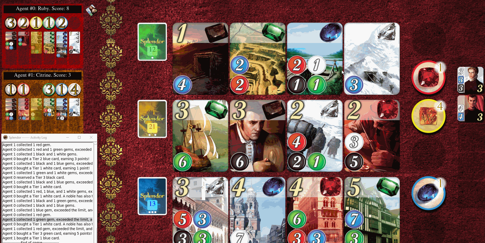

# Experiments and Analysis

You can include screenshots of precompetition results and animated gifs, to showcase the evolution of your agents.

## Experiments

### Minimax Experiments

Minimax is WORD FOR AN ALGORITHM THAT FINDS AN EXACT SOLUTION. Assuming a perfect evaluation function, the limitation of minimax is therefore how deep the tree generated by the algorithm gets before the timer runs out. This depth can be increased by reducing the number of nodes generated in the tree at each level (unless the computation to achieve this is high). Thus, we compare the number of nodes generated by different variations of Minimax as a metric for evaluating and comparing their performance.

In order to create a level playing field, 

### Result

### Analysis

The algorithm is significantly improved by introducing alpha-beta pruning (except for on the first depth where pruning isn't possible). 

The effectiveness of alpha-beta pruning in reducing nodes generated is also improved by sorting the top layer of moves. HOW?

### Experiment 2

### Result

### ...

## Analysis

## My First Agent - Approach Foo

The analysis should also related with the technique you used, not the `if-else` logic.

### Demo

#### Group results: Game - ?/?/? 
#### Tournament results: Position - ?

#### Strategy summary

| Pros | Cons |
|-----------------|:-------------|
| First body part | Second cell  |
| Second line     | foo          |

## My First Agent - Approach Foo

The analysis should also related with the technique you used, not the `if-else` logic.

### Demo

#### Group results: Game - ?/?/? 
#### Tournament results: Position - ?

#### Strategy summary

| Pros | Cons |
|-----------------|:-------------|
| First body part | Second cell  |
| Second line     | foo          |

## My First Agent - Approach Foo

The analysis should also related with the technique you used, not the `if-else` logic.

### Demo

#### Group results: Game - ?/?/? 
#### Tournament results: Position - ?

#### Strategy summary

| Pros | Cons |
|-----------------|:-------------|
| First body part | Second cell  |
| Second line     | foo          |

